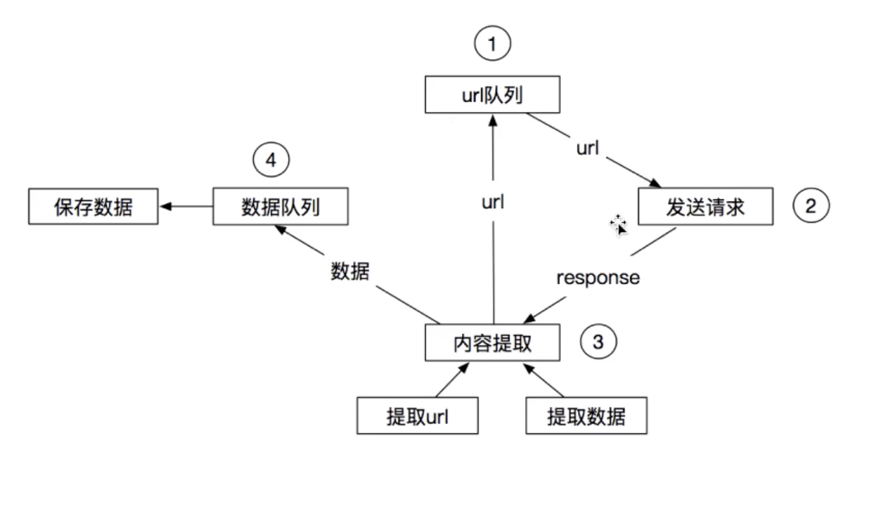
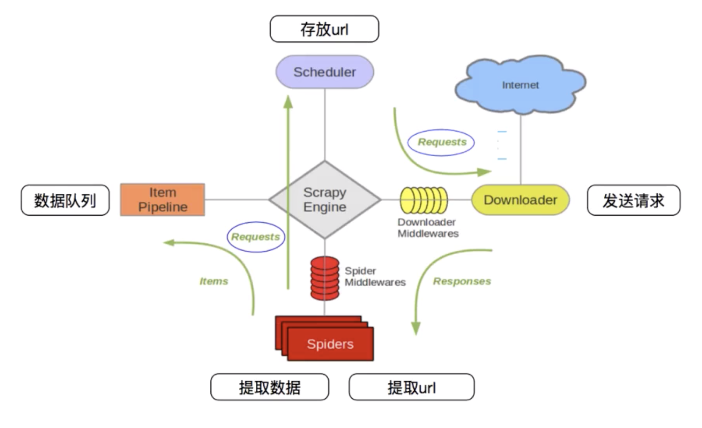

# 1 scrapy框架概览






# 2 入门Scrapy

## 2.1 创建项目

- 创建一个Scrapy项目

  `scrapy startproject NovelSpider`

- 生成一个爬虫

  `scrapy genspider novel "diyibanzhu.tel"`

- 提取数据

  完善spider，使用xpath等方法

- 保存数据

  pipeline中保存数据


## 2.2 启动项目

启动

`scrapy crawl novel`

如果不想看到太多的日志，可以在settings.py中添加

```python
BOT_NAME = 'NovelSpider'

SPIDER_MODULES = ['NovelSpider.spiders']
NEWSPIDER_MODULE = 'NovelSpider.spiders'

LOG_LEVEL = "WARNING"
```